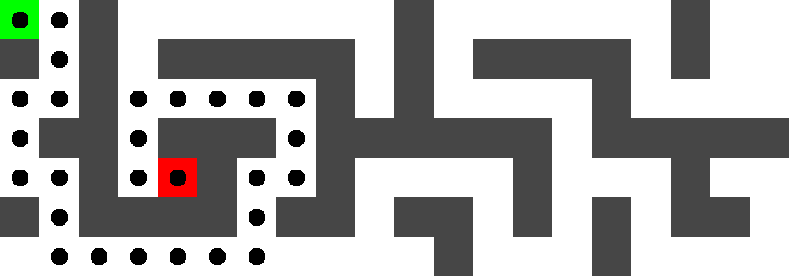
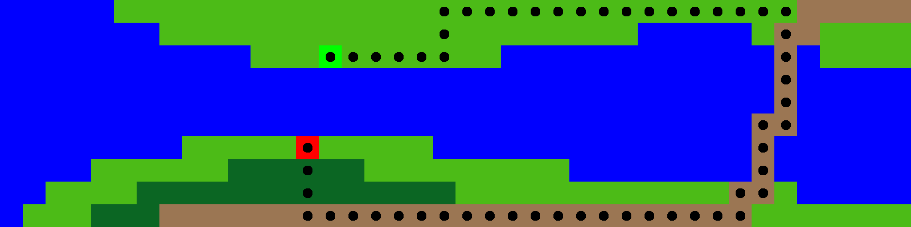

# Maze solver

## About project

This is the 2nd assignment in the course `TDT4136 - Introduction to Artificial Intelligence` at NTNU. 

## Installation
### Install pipenv

This project uses `pipenv`to handle dependencies and virtual environments. Make sure you have [pipenv](https://github.com/pypa/pipenv#installation) installed before proceeding.

### Install dependencies 
```
cd mazesolver
pipenv install
```
## Solve mazes

### 1) Store mazes in `static/`
Store the mazes to be solved in `mazesolver/mazes/`. Every file in this folder will be read as a maze, 
so be sure to only store valid maze files here.

### 2) Open shell
```
pipenv shell
```
### 3) Run main.py from shell
Run the `main.py` file by running the following command in the shell:
```
python3 src/main.py
```

  
## Maze file format
Maze file must be a `.txt` file consisting of only the following characters and each row must 
consist of **exactly** the same amount of characters.

```
Character map
---------------------------
# : Wall, impassable
A : Start of maze   (*)
B : End of maze     (*)
. : Corridor    cost = 1
  : Corridor    cost = 1
w : Water,      cost = 100
m : Mountain,   cost = 50
f : Forest,     cost = 10
g : Grassland,  cost = 5
r : Roads,      cost = 1

(*) = Mandatory characters which can only appear once in the document.
Without character an IOError will be raised.
```

## Example file and rendering:

### Example 1
```
A.#.......#......#..
#.#.#####.#.####.#..
..#.....#.#....#....
.##.###.######.#####
..#.B#..#....#...#..
#.####.##.##.#.#.##.
...........#...#....

```



### Example 2

```
wwwwwggggggggggggggggggggggggggggggrrrrr
wwwwwwwgggggggggggggggggggggwwwwwgrrgggg
wwwwwwwwwwwgggAgggggggwwwwwwwwwwwwrwgggg
wwwwwwwwwwwwwwwwwwwwwwwwwwwwwwwwwwrwwwww
wwwwwwwwwwwwwwwwwwwwwwwwwwwwwwwwwwrwwwww
wwwwwwwwwwwwwwwwwwwwwwwwwwwwwwwwwrrwwwww
wwwwwwwwgggggBgggggwwwwwwwwwwwwwwrwwwwww
wwwwggggggffffffgggggggggwwwwwwwwrwwwwww
wwggggffffffffffffffggggggggggggrrgwwwww
wgggfffrrrrrrrrrrrrrrrrrrrrrrrrrrggggggg

```




